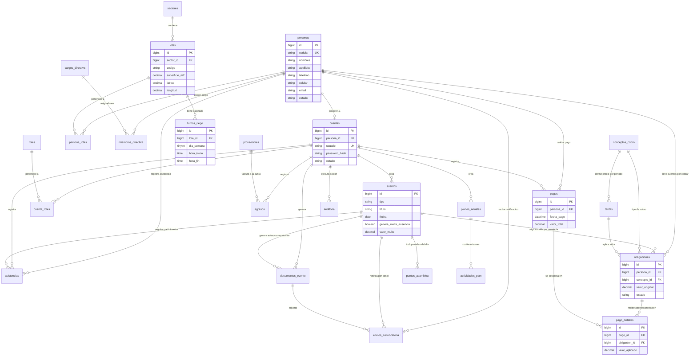

# 🗄️ Documentación del Diseño de la Base de Datos
## Sistema Integrado de Gestión de la Junta de Riego La Jones — Patate

---

## 1. 📌 Introducción

El presente documento describe la arquitectura, criterios de diseño y modelo entidad-relación que rigen la base de datos del **Sistema Integrado de Gestión de la Junta de Riego La Jones**, ubicada en el cantón Patate, provincia de Tungurahua.

El modelo relacional está compuesto por **26 tablas** normalizadas y distribuidas en **7 dominios funcionales**, diseñados para garantizar integridad, flexibilidad, conservación histórica de datos y trazabilidad en los procesos administrativos, financieros y de comunicación de la Junta.

---

## 2. 📐 Criterios Generales de Diseño

1. **Normalización de Información:** Reutilización del núcleo financiero basado en conceptos de cobro, tarifas, obligaciones y pagos para gestionar cuotas de agua, multas por asambleas y mingas sin duplicar estructuras.
2. **Separación entre Persona y Autenticación:** La tabla `personas` contiene la información personal de cada comunero, mientras que `cuentas` almacena credenciales de acceso. Esto permite registrar miembros que no necesariamente interactúan directamente con el sistema.
3. **Conservación de Información Histórica:** Manejo de tablas intermedias con rangos de fechas (ej. `miembros_directiva`, `persona_lotes`, `tarifas`) para preservar el historial sin sobrescribir registros pasados.
4. **Flexibilidad Financiera y Pagos Parciales:** Desacoplamiento entre **Obligación** (lo que se debe) y **Pago / Detalle de Pago** (lo que efectivamente se cobra), permitiendo pagos parciales y combinados.
5. **Auditoría y Trazabilidad:** Registro centralizado de acciones críticas (creación, modificación, anulación) en la tabla `auditoria` asociando usuario, IP y detalles JSON.

---

## 3. 🗂️ Organización del Modelo por Dominios (26 Tablas)

| Dominio Funcional | Tablas Integrantes | Descripción Breve |
| :--- | :--- | :--- |
| **Identidad y Organización** | `personas`, `cuentas`, `roles`, `cuenta_roles`, `cargos_directiva`, `miembros_directiva` | Gestión de miembros, usuarios del sistema, roles, permisos e historial de la directiva. |
| **Lotes y Riego** | `sectores`, `lotes`, `persona_lotes`, `turnos_riego` | Terrenos por sector, georreferenciación, propiedad/representación y horarios de agua. |
| **Eventos y Comunicación** | `eventos`, `puntos_asamblea`, `asistencias`, `documentos_evento`, `envios_convocatoria` | Asambleas y mingas, orden del día, resoluciones, control de asistencia y notificaciones por WhatsApp/Email. |
| **Finanzas** | `conceptos_cobro`, `tarifas`, `obligaciones`, `pagos`, `pago_detalles`, `proveedores`, `egresos` | Catálogo de cobros, historial de tarifas, cuentas por cobrar, recaudación, gastos y proveedores. |
| **Inventario** | `bienes_inventario` | Registro y control de bienes físicos y activos de la Junta. |
| **Planificación** | `planes_anuales`, `actividades_plan` | Plan operativo anual de trabajo y seguimiento de cumplimiento de actividades. |
| **Control & Auditoría** | `auditoria` | Bitácora general de operaciones sensibles realizadas por los administradores. |

---

## 📊 Diagrama Entidad-Relación (Mermaid ERD)

---

## 4. 📚 Detalle Funcional de Tablas y Reglas de Negocio

### 4.1. Dominio de Identidad y Organización
- **`personas`**: Almacena los miembros de la Junta. La cédula es única y obligatoria. Los campos de contacto son opcionales para adaptarse a miembros de la comunidad sin teléfono/email.
- **`cuentas`**: Credenciales de inicio de sesión con hash seguro para miembros o administradores con permisos de acceso al software.
- **`roles` & `cuenta_roles`**: Permite asignar permisos dinámicos (`ADMINISTRADOR`, `TESORERO`, `SECRETARIO`, `USUARIO`).
- **`cargos_directiva` & `miembros_directiva`**: Mantiene la historia de directivas (Presidente, Vicepresidente, Tesorero, etc.) indicando períodos de inicio y fin sin sobreescribir la historia.

### 4.2. Dominio de Lotes y Riego
- **`sectores`**: Catálogo de sectores geográficos dentro de Patate/Jones.
- **`lotes`**: Terrenos con superficie, coordenadas de latitud/longitud para abrir directamente la ubicación en visores como Google Maps u OpenStreetMap.
- **`persona_lotes`**: Tabla M:N que soporta copropiedad, derecho de usufructo o representación de un lote por parte de una o más personas.
- **`turnos_riego`**: Asigna horarios específicos de agua a un lote en particular. La lógica del backend valida el no solapamiento de horarios en el mismo canal/sector.

### 4.3. Dominio de Eventos y Comunicaciones
- **`eventos`**: Unifica Asambleas Generales y Mingas Comunitarias (`tipo`). Define si el evento requiere asistencia y si la inasistencia genera multa.
- **`puntos_asamblea`**: Puntos del orden del día con sus respectivas resoluciones aprobadas y estado de cumplimiento.
- **`asistencias`**: Registro de presencia de cada comunero (`PENDIENTE`, `PRESENTE`, `AUSENTE`, `JUSTIFICADO`).
- **`documentos_evento`**: Metadatos de convocatorias impresas y actas en PDF guardadas en servidor.
- **`envios_convocatoria`**: Control de envíos masivos por WhatsApp API o Email.

### 4.4. Dominio Financiero
- **`conceptos_cobro`**: Catálogo de conceptos (`AGUA_MENSUAL`, `MULTA_ASAMBLEA`, `MULTA_MINGA`, etc.).
- **`tarifas`**: Define el costo de cada concepto por período de vigencia.
- **`obligaciones`**: Cuentas por cobrar pendientes por usuario.
- **`pagos` & `pago_detalles`**: Registro de caja de dinero ingresado y desglose de qué obligaciones se están liquidando (soporta pagos parciales o pagos grupales).
- **`proveedores` & `egresos`**: Registro de gastos y compras realizadas por la Junta.

### 4.5. Dominio de Inventarios, Planificación y Auditoría
- **`bienes_inventario`**: Registro de bienes de la Junta (herramientas, tuberías, bombas, mobiliario).
- **`planes_anuales` & `actividades_plan`**: Plan operativo anual para seguimiento de compromisos de la Directiva.
- **`auditoria`**: Bitácora imborrable de operaciones financieras y administrativas.

---

## 5. 🛠️ Tipos de Datos Enumerados (Enums)

| Enum Name | Validez / Opciones |
| :--- | :--- |
| **`estado_persona`** | `ACTIVO`, `INACTIVO` |
| **`estado_cuenta`** | `ACTIVA`, `BLOQUEADA`, `INACTIVA` |
| **`tipo_relacion_lote`** | `PROPIETARIO`, `COPROPIETARIO`, `REPRESENTANTE` |
| **`estado_turno_riego`** | `ACTIVO`, `INACTIVO` |
| **`tipo_evento`** | `ASAMBLEA`, `MINGA` |
| **`estado_evento`** | `BORRADOR`, `CONVOCADO`, `REALIZADO`, `CANCELADO` |
| **`estado_asistencia`** | `PENDIENTE`, `PRESENTE`, `AUSENTE`, `JUSTIFICADO` |
| **`tipo_documento_evento`** | `CONVOCATORIA`, `ACTA`, `OTRO` |
| **`canal_envio`** | `WHATSAPP`, `EMAIL` |
| **`estado_envio`** | `PENDIENTE`, `ENVIADO`, `ERROR` |
| **`estado_obligacion`** | `PENDIENTE`, `PARCIAL`, `PAGADA`, `ANULADA` |
| **`metodo_pago`** | `EFECTIVO`, `TRANSFERENCIA`, `DEPOSITO`, `OTRO` |
| **`estado_plan`** | `BORRADOR`, `ACTIVO`, `CERRADO` |
| **`estado_actividad_plan`**| `PENDIENTE`, `EN_PROCESO`, `CUMPLIDA`, `NO_CUMPLIDA`, `CANCELADA` |
| **`estado_miembro_directiva`**| `VIGENTE`, `FINALIZADO` |
